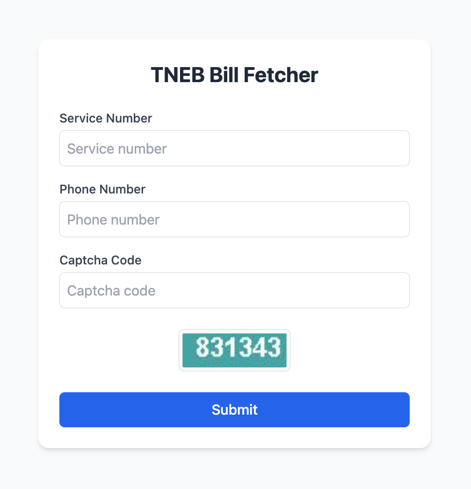
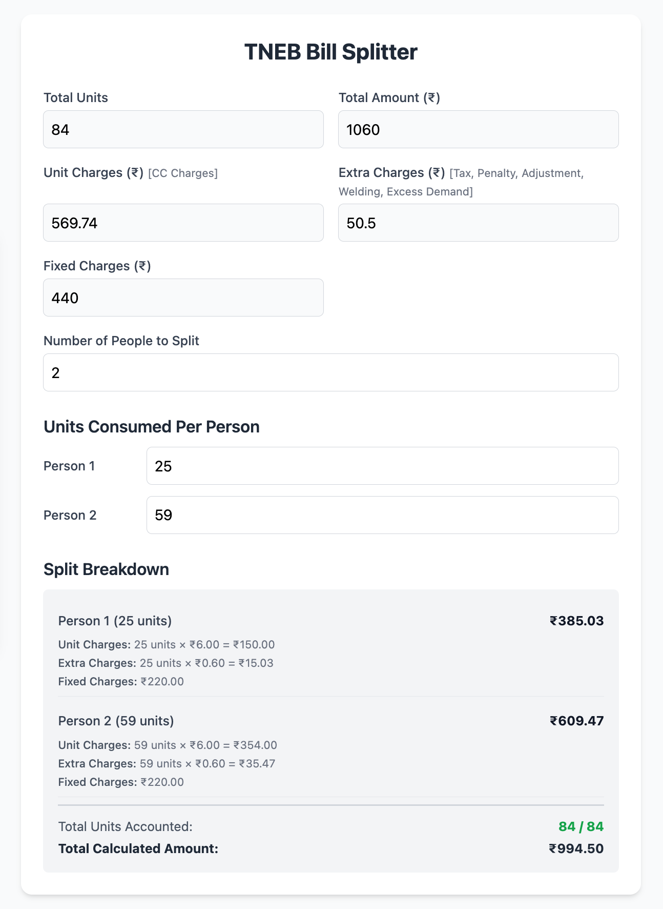

# TNEB Bill Splitter

A simple web application that helps you split your TNEB (Tamil Nadu Electricity Board) bill among multiple people.

> **Disclaimer:** This application is for educational purposes only. It is not intended to break or violate the Terms of Service (ToS) of other websites.

## Screenshots




## Prerequisites
- [Bun](https://bun.sh/) JavaScript Runtime.
- [Cloudflare Account](https://cloudflare.com/) (Optional: only requied if you want to deploy).

## Getting Started

### Clone and install the dependencies
```bash
git clone https://github.com/cj-praveen/tneb-bill-splitter.git
bun install
```

### Development
```bash
bun run dev
```

### Deploy
```bash
bun run deploy
```
